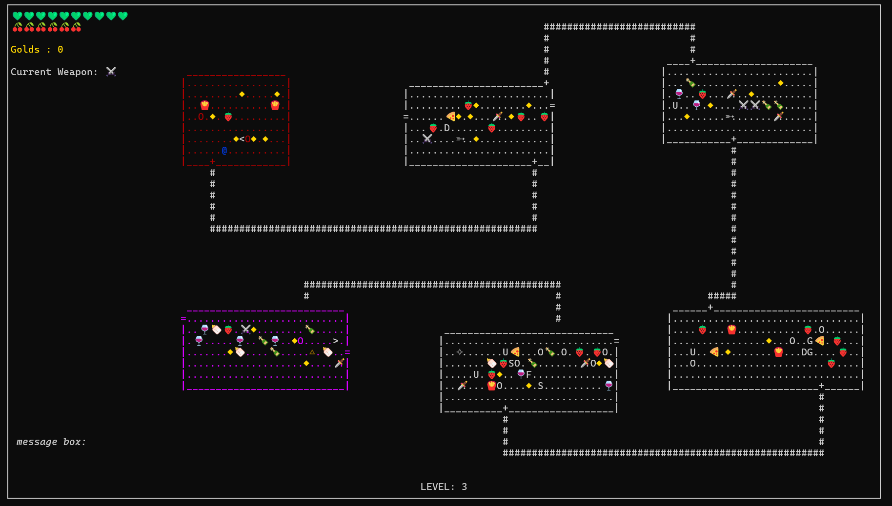

# Rogue


A fully-featured, terminal-based Rogue-like RPG written in C. The game utilizes the `ncurses` library for its grid-based ASCII rendering and `SDL2` / `SDL2_mixer` for immersive background music and audio management. 

Players explore procedurally generated dungeon floors, manage survival resources, fight varying classes of monsters, and compete for the highest score on the global leaderboard.


---


## 🌟 Core Features

### 🔐 Authentication & Player Profiles
*   **Account System:** Register securely with password complexity requirements and email validation, log in to an existing account, or play locally as a guest.
*   **Profile Tracking:** Check your lifetime statistics on the Profile page, which tracks total points, accumulated gold, completed runs, and total playtime (calculated as XP in days and hours). You can securely toggle your password visibility directly from this menu.
*   **Global Scoreboard:** A paginated leaderboard sorts all registered users by their total points. The top three players are highlighted with special titles (Goat 🥇, Legend 🥈, and Champ 🥉).

### 🗺️ Map Generation & Exploration
*   **Procedural Dungeons:** Every floor is randomly generated using custom boundary logic, featuring multiple rooms connected by intricate corridors. 
*   **Room Themes:** Navigate through distinct environments, including Regular rooms, Enchant rooms (which spawn more potions), Nightmare rooms (which restrict your vision radius), and the ultimate Treasure room.
*   **Interactables:** The dungeon is filled with hidden doors, concealed floor traps, structural pillars, line-of-sight windows, and password-locked doors that require uncovering a 4-digit pin or utilizing an Ancient Key.

### ⚔️ Combat & Survival
*   **Dynamic Arsenal:** Equip and swap between various weapons from your backpack. Engage in close-quarters combat with a Mace or Sword, or target enemies from afar with Daggers, Normal Arrows, and paralyzing Magic Wands.
*   **Enemy AI:** Survive against 5 unique monster types—Demons, Fire Breathing Monsters, Giants, Snakes, and the Undead—each featuring distinct health pools, damage outputs, and tracking behaviors.
*   **Hunger System:** Manage your saturation by consuming food (Normal, Premium, Magical, or Rotten). Beware: hoarding food for too long will cause it to rot.
*   **Status Potions:** Discover and drink potions to gain temporary, 10-turn buffs: Health (rapid regeneration), Speed (double movement), or Damage (amplified attack power).

### ⚙️ Settings & State Management
*   **Customization:** Adjust the game difficulty (Easy, Medium, or Hard) and choose your hero's display color (White, Blue, or Green) directly from the Settings menu.
*   **Binary Save System:** Quit anytime without losing progress. The game uses a robust binary serialization system to save the exact state of your dungeon, enemy positions, trap states, and entire inventory, allowing you to resume exactly where you left off.
*   **Integrated Audio:** Enjoy seamless background music playback with an in-game track selector menu powered by `SDL2_mixer`.

---

## 🎮 Controls

### Navigation & Exploration
*   **W, A, S, D / Arrow Keys:** 8-way directional movement (can navigate diagonally).
*   **e:** Toggle Fast-Travel mode (move rapidly until hitting an obstacle or room boundary).
*   **m:** Toggle full map visibility (Reveal Mode).
*   **q:** Defuse adjacent floor traps.
*   **< / >:** Ascend or descend staircases to change dungeon levels.

### Combat & Inventory
*   **i:** Open the Weapons backpack to equip melee or projectile weapons.
*   **f:** Open the Food menu to consume meals and restore hunger.
*   **u:** Open the Potions menu to activate temporary buffs.
*   **Spacebar:** Fire the currently equipped melee/ranged weapon.
*   **a:** Quickly repeat the exact trajectory of your last ranged attack.

### System
*   **Backspace:** Pause the game and open the pause menu (Resume, Quit, Save & Quit).
*   **Tab:** Open the Audio/Music playback menu.

---

## 🚀 Building and Running

### Prerequisites
Ensure you have a C compiler (like `gcc`), the `ncurses` library, and `SDL2` / `SDL2_mixer` installed on your system.

### Compilation
You can compile the game automatically using the provided shell script:
```bash
chmod +x exec.sh
./exec.sh